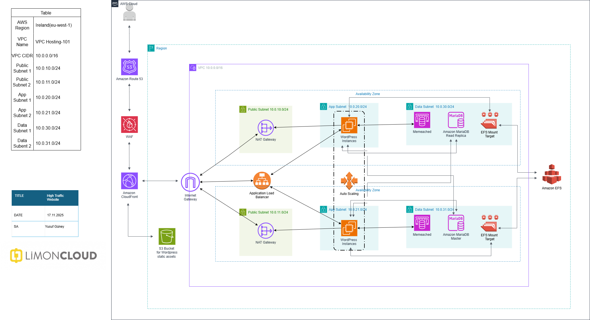

# 📝 Project Description

This repository contains a high-availability and high-performance WordPress architecture designed on AWS.  
The project demonstrates how to build a **scalable**, **secure**, and **fault-tolerant** infrastructure capable of handling **up to 10,000 concurrent users** using the following AWS services:

- **Amazon EC2 (Auto Scaling)**
- **Amazon RDS for MariaDB**
- **Amazon ElastiCache (Memcached)**
- **Amazon EFS**
- **Amazon CloudFront**
- **AWS WAF**
- **Amazon Route 53**

The goal of this project is to modernize traditional WordPress hosting by leveraging **cloud-native AWS components** to achieve improved performance, security, and reliability.

---

## 📌 Architecture Diagram

Below is the complete AWS solution design created for this WordPress project:

